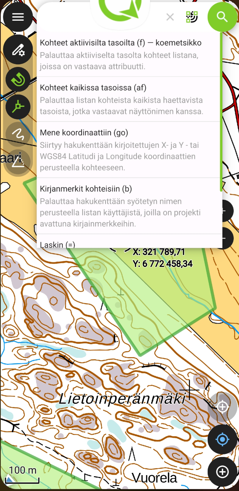
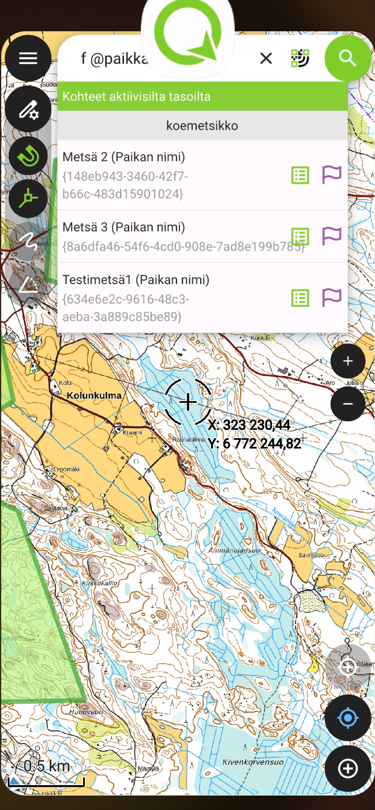

# Metsäkoetietojärjestelmän PoC-version käyttäminen

Kun edeltävien sivujen toimenpiteet on tehty (valmistelu QGISillä, paketointi ja siirto QFieldiin, asetusten ja käyttäjnimen muokkaus) on tehty, voidaan ruveta testaamaan Metsäkoetietojärjestelmän PoC-version (jatkossa MKTJ-PoC) käyttöä digitointiin, datan tarkasteluun ja keruuseen. 

## Huomioita 

- Esimerkiksi kuvaustyylit ja tiedonsyöttö-lomakkeet on konfiguroitu QGISissa, ja näitä voidaan muuttaa halutunlaisiksi.
- Projektiin on konfiguroitu QGISissa myös ns. tarttumisasetukset (snapping) digitointia helpottamaan. Tämäkin toiminnallisuus toimii QFieldissa täysin samoin kuin QGISissa.

- Digitointia voi suorittaa myös hyödyntämällä paikannuslaitteen jäljitystä (tracking) tai esimerkiksi vapaamuotoista piirtoa stylus-kynällä, mutta tässä kuvataan vain perusdigitointi manuaalisesti kohteiden taitepisteitä klikkaillen.

## Tietojen keruu ja muokkaus

QGISissä valmisteltu Geopackage-tiedosto (mktj.gpgk), sisältää tasoja, jotka on mallinnettu yksinkertaistaen Metsäkoetietojärjestelmän  testitietokannan perusteella. Geopackage sisältää samat päätaulut sisältäen samat attribuutit ja tietotyypit, sekä taulujen väliset  relaatiot. Kaikkia koodi-tauluja tai ulkoisia tietolähteitä ei ole testiversiossa mukana. 

- Uutena attribuuttina tasoille on lisätty UUID-kenttä (universally unique identifier) dokumentaation suositusten mukaisesti:
[https://docs.qfield.org/how-to/attributes-form/#key-handling](https://docs.qfield.org/how-to/attributes-form/#key-handling). Tieto takaa, että primääriavaimet pysyvät yksilöivinä offline-työskentelyssäkin. QField täyttää UUID-arvon automaattisesti, eikä tietokenttä välttämättä näyt käyttäjälle.

Tasoilla on joitakin muitakin attribuutteja, joiden tiedot QField täyttää automaattisesti oletusarvoilla kuten muokkaaja, luoja, luonti- ja muokkaushetki.

### Koemetsikkö-taso

Lisätään ensin koemetsikkö. Avaa päävalikko, laita muokkaustila päälle kynäikonista (kts. kuva) ja valitse sitten Koemetsikkö-taso klikkaamalla.

Klikataan takaisin karttaikkunaan ja digitoidaan koemetsikkö haluttuun sijaintiin kartalle. Tämä tapahtuu seuraavasti:

Pakollisia tietoja on ainoastaan koemetsikön voimassaolon alkupäivä; kun se on lisätty, attribuuttilomake muuttuu punaisesta (jolloin kohteen tallentaminen ei onnistu) vihreäksi, jolloin tietojen tallentaminen onnistuu ylhäältä ruksista. Tietoja voidaan täydentää myöhemmin QFieldissä (muokkaustilassa ja valitsemalla ko. kohde aktiiviseksi) tai QGISissa.

Koemetsiköllä voi olla useita siihen liittyviä muiden tasojen kohteita: siihen voi liittyä monta koealaa, liittyviä kohteita (liittyvät pisteet, viivat ja alueet), toimenpidettä sekä koetta. Nämä hoidetaan Geopackagessa relaatioilla taulujen välillä (avain taulujen välillä on UUID-kenttä). Näitä kohteita voi lisätä suoraan luotavaan koemetsikköön sitä digitoitaessa. On mentävä attribuuttitaulun **Alikohteet"**-välilehdelle ja lisättävä haluttu liittyvä kohde plus-ikonista, jolloin kyseisen tason attribuuttilomake aukeaa:

Liittyvän kohteen pystyy koemetsikölle lisäämään myöhemminkin myös kyseistä alikohde-tasoa (esim. Koeala) suoraan muokkaamalla.

### Koeala-taso

- Digitointi ja tietojen syöttö kuten Koemetsikkö-tasolle. Myös koealalla on relaatio liittyvien pisteiden/viivojen/alueiden tasoihin ja 
koealalle voidaan luoda alikohde näihin tasoihin

### Liittyvät kohteet

- Digitointi ja tietojen syöttö kuten Koemetsikkö-tasolle

### Kokeet ja toimenpiteet

- Kokeet ja toimenpiteet eivät sisällä geometriaa. Tietojen lisääminen tasoille tapahtuu kuitenkin aivan analogisesti edellä kuvattujen geometria-tasojen kanssa. Kohteen lisäys -napista aukeaa kuitenkin nyt suoraan attribuuttilomake geometrian lisäys-työkalun sijaan.

### Tietojen haku tasoilta

QFieldillä voi hakea kohteita monin tavoin, esimerkiksi tasojen attribuuttien avulla tai koordinaattien avulla (WGS84 sekä projektin koordinaattijärjestelmä (tässä tapauksessa EPSG:3067b) ovat mahdollisia käyttää). Klikkaamalla suurennuslasia QFieldin oikeassa ylänurkassa saa hakuvaihtoehdot esiin:

Esimerkiksi aktiiviselta tasolta kohteita voi hakea syntaksilla `a @<attribuuttinimi> <attribuutin arvo>`: 

### Massatoiminnot

QFieldillä on joitakin ominaisuuksia massamaisiin editointeihin, kuten prosessointialgoritmien ajo usealle kohteelle (esim. orthogonalize, rotate, smooth). 

Myös monen kohteen attribuuttien muokkaus:

- Klikkaa päävalikossa tasoa > avaa kohdelista > oikeasta yläkulmasta 3 pistettä > vaihda kohdevalinta > ruksi muokattavat kohteet > muokkaa.

- Tarkemmat ohjeet ja esimerkit tulossa.

### Karttateemat

- Ei vielä implementoitu

