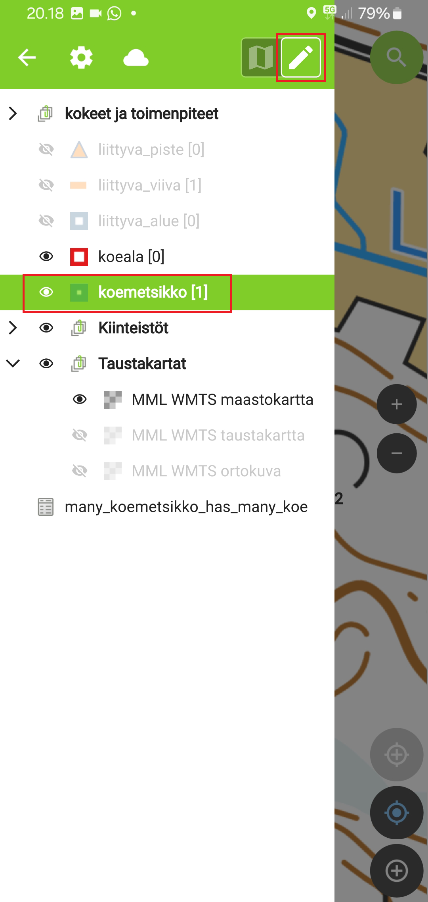

# Metsäkoetietojärjestelmän PoC-version käyttäminen

Kun edeltävien sivujen toimenpiteet on tehty (valmistelu QGISillä, paketointi ja siirto QFieldiin, asetusten ja käyttäjnimen muokkaus) on tehty, voidaan ruveta testaamaan Metsäkoetietojärjestelmän PoC-version (jatkossa MKTJ-PoC) käyttöä digitointiin, datan tarkasteluun ja keruuseen. 

## Huomioita 

- Esimerkiksi kuvaustyylit ja tiedonsyöttö-lomakkeet on konfiguroitu QGISissa, ja näitä voidaan muuttaa halutunlaisiksi.
- Projektiin on konfiguroitu QGISissa myös ns. tarttumisasetukset (snapping) digitointia helpottamaan. Tämäkin toiminnallisuus toimii QFieldissa täysin samoin kuin QGISissa.

- Digitointia voi suorittaa myös hyödyntämällä paikannuslaitteen jäljitystä (tracking) tai esimerkiksi vapaamuotoista piirtoa stylus-kynällä, mutta tässä kuvataan vain perusdigitointi manuaalisesti kohteiden taitepisteitä klikkaillen.

## Tietojen keruu ja muokkaus

QGISissä valmisteltu Geopackage-tiedosto (mktj.gpgk), sisältää tasoja, jotka on mallinnettu yksinkertaistaen Metsäkoetietojärjestelmän  testitietokannan perusteella. Geopackage sisältää samat päätaulut sisältäen samat attribuutit ja tietotyypit, sekä taulujen väliset  relaatiot. Kaikkia koodi-tauluja tai ulkoisia tietolähteitä ei ole testiversiossa mukana. 

- Uutena attribuuttina tasoille on lisätty UUID-kenttä (universally unique identifier) dokumentaation suositusten mukaisesti:
[https://docs.qfield.org/how-to/attributes-form/#key-handling](https://docs.qfield.org/how-to/attributes-form/#key-handling). Tieto takaa, että primääriavaimet pysyvät yksilöivinä offline-työskentelyssäkin. QField täyttää UUID-arvon automaattisesti, eikä tietokenttä välttämättä näyt käyttäjälle.

Tasoilla on joitakin muitakin attribuutteja, joiden tiedot QField täyttää automaattisesti oletusarvoilla kuten muokkaaja, luoja, luonti- ja muokkaushetki.

### Koemetsikkö-taso

Lisätään ensin koemetsikkö. Avaa päävalikko, laita muokkaustila päälle kynäikonista (kts. kuva) ja valitse sitten Koemetsikkö-taso klikkaamalla.

Klikataan takaisin karttaikkunaan ja digitoidaan koemetsikkö haluttuun sijaintiin kartalle. Tämä tapahtuu seuraavasti:

### Koeala-taso

### Liittyvät kohteet

### Kokeet ja toimenpiteet

### Tietojen haku tasoilta

### Massatoiminnot

### Karttateemat

