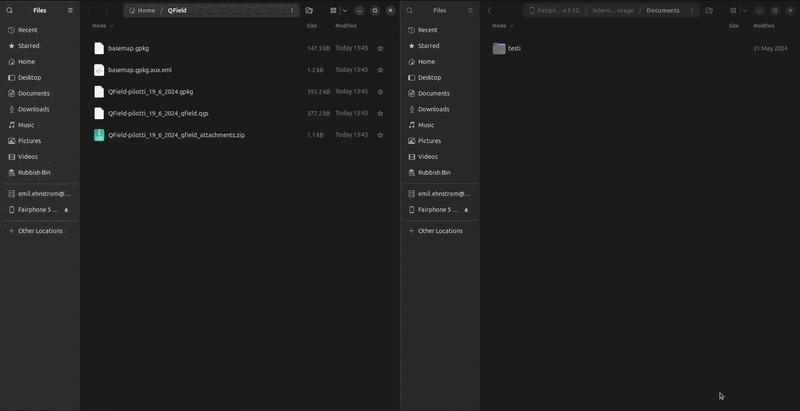

# Projektin vienti QFieldiin

## Projektin pakkaaminen

QGIS-projekti viedään QFieldiin kopioimalla tarvittavat tiedostot sisältävä kansio tietokoneelta mobiililaitteelle. Ensin pitää kuitenkin tehdä pakkaaminen QField Sync-lisäosan kautta. Avaa **Pakkaa QFieldiä varten** "Package for QField" työkalupalkista 

tai valikosta **Lisäosat-> QFieldSync-> Pakkaa QFieldiä varten**. Oletuskansiona, johon QField-projekti paketoidaan, on käyttäjän kotikansion alla olevan QField-kansion Export-alikansio (Esim. C:\Users\käyttäjänimi\QField\Export). Valitse tai luo tyhjä kansio sopivaan sijaintiin ja paina **Luo** (Create). Prosessin valmistuttua QGISin karttaikkunan ylälaidan palkkiin tulee ilmoitus onnistumisesta ja kansiosijainti, jota klikkaamalla pääsee ko. sijaintiin.

Voit katsoa esimerkkiä alla olevasta videosta. 

Jos et ole vielä kytkennyt omaa puhelinta tietokoneeseen esimerkiksi usb-kaapelilla, niin tee se. Käy sitten kopioimassa kaikki tiedostot (eli käytännössä em. kansio) jotka äsken loit lisäosan avulla ja siirrä ne puhelimeen sellaiseen sijaintiin, jonka  muistat. 

---
**Huom!**

 Jos tietokoneella ei pääse näkemään yhtään tiedostoja puhelimella, niin avaa puhelimen näyttö ja salli tarvittaessa yhteyden muodostaminen. Saattaa olla tarpeen myös tarkistaa puhelimen asetuksista, että tiedostojen siirto on sallittu, eikä pelkkä lataus.

**Huom!** 

Tässä mainittu tapa siirtää tiedostot usb-kaapelilla ei suinkaan ole ainoa mahdollinen, vaan mikä tahansa tapa siirtää tiedostja laitteiden välillä sinällään käy. 

---
## Tiedostojen siirto
Siirtäminen tapahtuu esimerkiksi raahaamalla valitut tiedostot, tai kopioimalla kuten alla. Suosittelemme että luot uuden kansion jokaiselle projektille, jotta tiedostopolut ovat selkeitä.

